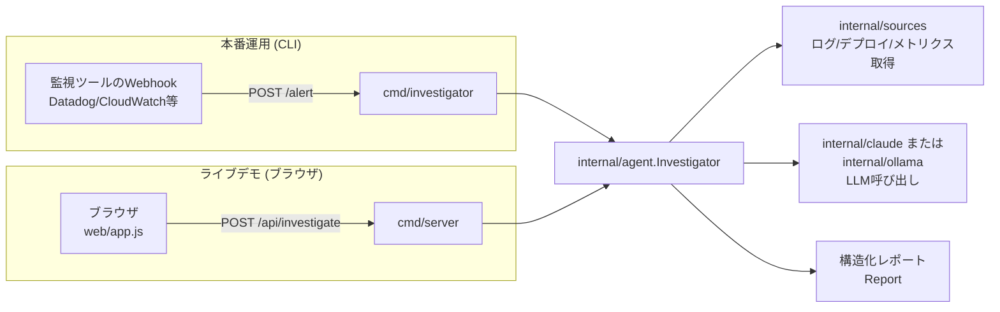
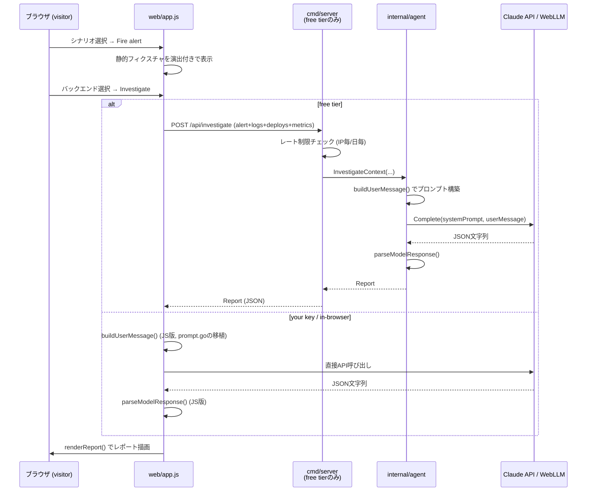

# コードの流れ (アーキテクチャ解説)

`README.md` はプロジェクトの概要とセットアップ方法をまとめたものですが、
このドキュメントは「実際にコードがどう繋がって動いているか」を、ライブデモ
(<https://incident-agent-demo.onrender.com/>) の操作フローに沿って追った
ものです。

## 1. 全体像

このプロジェクトには **2つのエントリーポイント** があります。

| バイナリ | 役割 | ソース |
|---|---|---|
| `investigator` (CLI) | 本番運用を想定した、Webhookで受けたアラートを実際に調査するツール | `cmd/investigator/main.go` |
| `server` (デモサーバー) | ブラウザ上でライブデモを動かすためのHTTPサーバー | `cmd/server/main.go` |

どちらも中核ロジックである `internal/agent.Investigator` を共有しています。
つまり「アラートを受け取る → コンテキスト(ログ/デプロイ/メトリクス)を集める
→ Claudeに投げる → 構造化レポートを返す」という一本のパイプラインを、CLIと
デモサーバーの両方が呼び出しているだけです。



---

## 2. ライブデモの画面操作とコードの対応

デモページ (`web/index.html` + `web/app.js`) は **ビルド不要の素のES
モジュール** で書かれています。画面上の操作ごとに、対応するコードを追って
いきます。

### ステップ1: シナリオを選ぶ

画面左の「Scenarios」パネルには3つの作り込まれたインシデントが並んでいます
(`web/app.js` の `buildScenarios()`, 26〜118行目)。

- `checkout-bad-deploy` — デプロイ4分後に5xxが急増。ログ・デプロイ・
  メトリクスの時刻を並べると明確に相関する「当たり」ケース。
- `db-pool-exhaustion` — 直近デプロイなし。DBコネクションプールの
  じわじわとした枯渇が原因という、デプロイ相関では説明できないケース。
- `noisy-false-alarm` — 1点だけ閾値を超えて自然に回復した誤検知に近い
  ケース。モデルが「証拠が薄いので確信度を下げる」を実際にできるかを
  見るための題材。
- `custom` (Paste your own data) — 任意のJSONを貼り付けて試せる自由入力
  モード (`parseCustomData()`, 391〜457行目)。`internal/alert.Alert` /
  `internal/sources` と同じフィールド名を使っていれば構造化データとして
  扱われ、それらのキーが一つもなければ「構造化ロガーの1行」とみなして
  自動的にラップします (`wrapAsSingleLogEntry()`, 364〜382行目)。

`selectScenario()` (505〜513行目) がクリックを受けてアラート内容を
`renderAlert()` で描画します。

### ステップ2: 「Fire alert & gather context」を押す

`fireBtn` のクリックハンドラ (552〜583行目) が実行されます。ここは
**演出用の疑似非同期処理** で、実際にはシナリオに埋め込み済みの静的
フィクスチャデータをそのまま使い、`sleep()` を挟みながら「ログ収集中…」
「デプロイ確認中…」「メトリクス取得中…」というログを画面下の「Activity」
パネルに順に流します。本番のCLI/サーバーモードで `internal/agent.gatherContext`
が実際に並行実行している処理(後述)を、デモでは視覚的に模しています。

完了すると `renderContext()` がログ・デプロイ・メトリクスをパネルに描画し、
「Investigate」ボタンが有効になります。

### ステップ3: LLMバックエンドを選ぶ

「Investigate」パネル上部の3つのボタンで、レポート生成に使うモデルを
切り替えられます (`setBackend()`, 592〜601行目)。

| バックエンド | 何が起きるか | 対応関数 |
|---|---|---|
| **Claude API (free tier)** ※デフォルト | ブラウザ→自サーバーの `/api/investigate` → サーバー内で保持しているAPIキーでClaudeを呼ぶ。レート制限あり。 | `runFreeApi()` |
| **Claude API (your key)** | ブラウザから直接 Anthropic の `/v1/messages` を叩く。キーは `localStorage` に保存され、サーバーには一切送られない。 | `runClaudeApi()` |
| **In-browser AI (free)** | WebGPU上で小型モデル (Qwen2.5-0.5B-Instruct) をWebLLM経由でロードし、ブラウザ内だけで推論する。キー不要・レート制限なし。 | `runWebLLM()` |

### ステップ4: 「Investigate」を押す

`investigateBtn` のクリックハンドラ (751〜814行目) が選択中のバックエンドに
応じて分岐します。

- **free tier**: `runFreeApi(s)` が、集めたアラート/ログ/デプロイ/メトリクス
  一式をJSONで `POST /api/investigate` に送るだけ。プロンプト構築や
  JSONパースはすべてサーバー側 (`internal/agent`) が行うため、ブラウザ側は
  結果をそのまま `renderReport()` に渡せます。
- **your key / in-browser**: ブラウザ側で `buildUserMessage()` (205〜244行目、
  `internal/agent/prompt.go` の `buildUserMessage` と1行1行対応する移植版)
  を使ってユーザーメッセージを組み立て、`SYSTEM_PROMPT` (132〜162行目、
  こちらも `internal/agent/prompt.go` の `SystemPrompt` と同一文面) と共に
  それぞれのAPIへ渡します。返ってきた生テキストを `parseModelResponse()`
  でJSONとして解析します。

結果は `renderReport()` (820〜841行目) が要約・根本原因の仮説一覧(確信度と
根拠つき)・推奨アクション・怪しいデプロイのリストとして画面に描画します。



---

## 3. サーバー側 (`cmd/server`) の内部フロー

デモの「free tier」バックエンドを選んだときだけ、実際のGoサーバーコードが
動きます。

1. **`cmd/server/main.go`** — 起動時に `ANTHROPIC_API_KEY` が設定されて
   いれば、`internal/claude.NewClient` でClaudeクライアントを作り、
   `agent.NewInvestigator(claudeClient)` でInvestigatorを組み立てます
   (モデルは `claude-haiku-4-5` 固定、`MaxTokens=1200`)。レート制限器
   (`newRateLimiter`) も同時に作成し、`POST /api/investigate` に紐づけます。
   キーが無ければこのルートは登録されず、free tierは無効になります
   (WebLLM/BYOキーだけが使える状態)。
2. **`cmd/server/ratelimit.go`** — IPごとに1時間あたりの上限
   (`FREE_TIER_MAX_PER_IP_PER_HOUR`, デフォルト5回)、サーバー全体で1日
   あたりの上限 (`FREE_TIER_MAX_PER_DAY`, デフォルト200回) をメモリ上で
   管理します。共有のAPIキーの請求額を守るためのガードです。
3. **`cmd/server/investigate_handler.go`** — リクエストボディを
   256KBに制限した上でデコードし、`inv.InvestigateContext(...)` を
   30秒タイムアウト付きで呼び出します。ここで呼ぶのは `Investigate`
   ではなく `InvestigateContext` — ブラウザがすでにログ/デプロイ/
   メトリクスを(フィクスチャとして)持っているので、サーバー側で改めて
   ソースから取得し直す必要がないためです。

---

## 4. コアロジック: `internal/agent`

CLIのWebhookモードとサーバーのfree tierモード、両方が最終的にここへ
たどり着きます。

### `Investigate` vs `InvestigateContext`

`internal/agent/investigate.go` には2つの入口があります。

- **`Investigate(ctx, alert)`** — CLI (`cmd/investigator`) が使う経路。
  `gatherContext()` を呼んで、設定済みの `LogSource` / `DeploySource` /
  `MetricSource` から実際にデータを取得してから、`InvestigateContext` に
  渡します。
- **`InvestigateContext(ctx, alert, logs, deploys, metrics, sourceErrors)`**
  — デモサーバーが使う経路。データはすでに手元にあるので、取得ステップを
  飛ばしてプロンプト構築とLLM呼び出しだけを行います。

### `gatherContext` — 部分失敗に強いコンテキスト収集

CLIの `Investigate` から呼ばれる `gatherContext()` (139〜209行目) は、
ログ・デプロイ・各メトリクスの取得を **goroutineで並行実行** します。
重要なのは、いずれかのソースが失敗 (タイムアウトやAPIレート制限など) して
も、調査全体を中断しないという設計です。失敗は `sourceErrors` に文字列
として記録され、後段でモデルへの指示文に埋め込まれます
(「証拠に欠けがあるので確信度を控えめに」)。README の「Design decisions」
にある “Context gathering tolerates partial failure” はこの部分の実装を
指しています。

### `buildUserMessage` と `SystemPrompt` — プロンプト構築

`internal/agent/prompt.go` の `SystemPrompt` (定数) が、モデルに
「経験豊富なSREとして、与えられた証拠だけから原因を推論し、指定のJSON
形式で厳密に返す」ことを指示します。`buildUserMessage()` はアラート・
ログ・デプロイ・メトリクス・ソースエラーをMarkdown風のテキストに整形します。
この2つは `web/app.js` にJavaScriptとして一字一句移植されており、
BYOキー/WebLLMバックエンドが同じ挙動になるようにしてあります。

### `parseModelResponse` — 出力の厳格なパース

モデルの生テキストは、まれにmarkdownのコードフェンス (```json ... ```) で
囲まれて返ってくることがあるため、それだけは許容してから `json.Unmarshal`
します。それ以外の形式崩れ (フィールド不足・型不一致など) はエラーとして
呼び出し元に返され、生テキストも一緒に添付されます。「もっともらしく
見えるが壊れたレポート」より「見えるパース失敗」の方が安全、という判断です。

---

## 5. LLMクライアント: `internal/claude` と `internal/ollama`

`internal/agent.Investigator` はこの狭いインターフェースだけに依存します。

```go
type ClaudeClient interface {
    Complete(ctx context.Context, systemPrompt, userMessage string, maxTokens int) (string, error)
}
```

- **`internal/claude.Client`** — Anthropic Messages API (`/v1/messages`)
  への素のHTTPクライアント (SDK不使用)。429/529 (レート制限) や5xxは
  指数バックオフ+ジッターで自動リトライし、リトライを使い切ってもなお
  レート制限なら `ErrRateLimited` を返します。
- **`internal/ollama.Client`** — ローカルの Ollama サーバー
  (`http://localhost:11434` がデフォルト) にHTTPで問い合わせる、無料で
  APIキー不要な代替バックエンド。同じ `Complete` シグネチャを実装して
  いるため、`Investigator` 側のコードは一切変更なしに差し替え可能です。

どちらを使うかは `cmd/investigator/main.go` の `buildLLMClient()` が
`-provider` フラグ (または `ANTHROPIC_API_KEY` の有無) で決定します。
デモサーバー (`cmd/server`) は常に `internal/claude.Client` 固定です。

---

## 6. CLIの2つの動作モード (`cmd/investigator`)

ライブデモには出てきませんが、本来の運用形態として押さえておくべき2モード
です。

- **`investigate`** (ワンショット) — コマンドラインで指定した1件の
  アラートをその場で調査し、標準出力とオプションでSlack Webhookに結果を
  出します。
- **`serve`** (Webhookサーバー) — `POST /alert` を受け付け、**即座に
  202 Acceptedを返してから goroutine で非同期に調査を開始**します
  (`cmd/investigator/main.go` 188〜203行目)。これは監視ツール側の
  Webhookタイムアウト・再送によって同じアラートが二重調査されるのを防ぐ
  ための設計です。調査結果は `internal/notify` (コンソール or Slack) で
  配信されます。

---

## 7. 要点まとめ

- **プロンプトとレスポンス処理は1箇所 (`internal/agent`) が正**で、
  デモのJS版はそれを意図的に一字一句移植したコピーです。
- **「調査するだけで実行はしない」** という制約はシステムプロンプト自体に
  書き込まれており、コード上のガードではなく指示文レベルの境界線です。
- **部分失敗を許容する設計**が `gatherContext` (収集側) と
  `parseModelResponse` (パース側) の両方に貫かれています — 収集失敗は
  握りつぶして続行、パース失敗は握りつぶさずに可視化する、という
  非対称な扱いになっている点が読みどころです。
